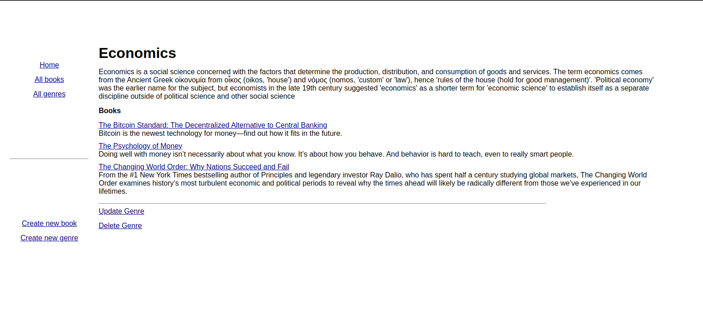

# odin-inventory-application

[Demo Link](https://radiant-wildwood-18493.herokuapp.com/)

The Odin Project Curriculum - Full Stack JavaScript Path - NodeJS Section - Project Nº23

Goal: Create an inventory management app for an store.

## Features:

- CRUD methods

## Technologies:

- MEN Stack (MongoDB, ExpressJS, Node.js)

## Demo Pic

